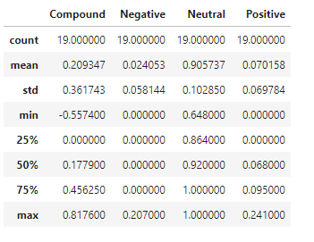
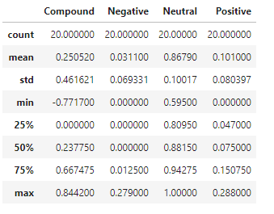
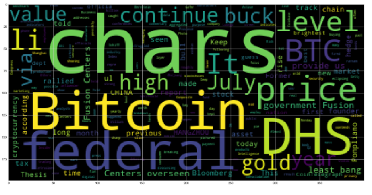
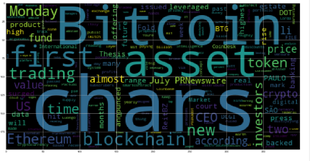
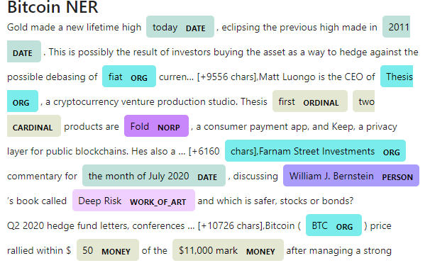
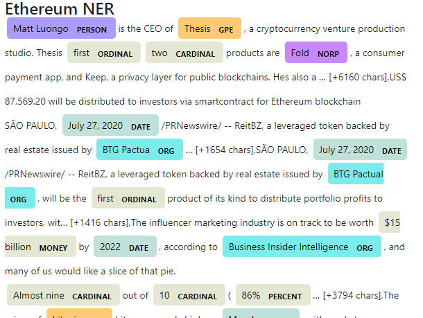

#Unit 12 HW 
## Takles from the Crypto, Natural Language Processing
### Alex Waters 7/29/20
---
**News Headlines Sentiment**

*Questions

Bitcoin Positive Mean

Ethereum Positive Mean

1. Which coin had the highest mean positive score?
    The Ethereum had the highest mean positive score at .1 vs .07 of bitcoin.

2. Which coin had the highest compound score?
    Ethereum inched out bitcoing with the max compound score of .84 vs .81.
    
3. Which coin had the highest positive score?
    Ethereum had the highest positive score with .28 vd .24 for bit coin.
---    
**Tokenizer**
**NGrams and Frequency Ananlysis**
Was not able to get the list of words to count appropriately.  
**Word Clouds**
Bitcoin Word Cloud

Ethereum Word Clound

---
**NAMED ENTITY RECOGNITION**
**Bitcoin NER**
Sample of Bitcoin

**Ethereum NER
Sample of Ethereum
